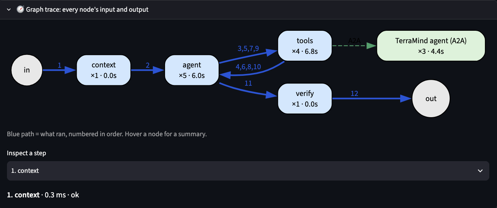

# EVE Earth-Observation Agent — LangGraph + MCP + A2A

A single LangGraph ReAct agent for Earth Observation queries — geocode a
place, search satellite imagery (STAC), get weather, and (optional) embed and compare scenes with
the TerraMind foundation model through a separate A2A agent. It is exposed over HTTP and calls
its tools through a real MCP server, with per-session conversation state, bounded context, a
groundedness check on every answer, and a readable trace of every tool call.

**Contents**

| | |
|---|---|
| [Install & run](#install--run-clean-checkout) | set up and start everything from a clean checkout |
| [Architecture](#architecture) | the processes and how they connect |
| [The graph](#the-graph) | context, agent, tools and verify nodes; where sessions are kept |
| [MCP server](#mcp-server) | the 5 EO tools |
| [Context policy](#context-policy) | how the prompt is kept bounded |
| [Hallucination control and evals](#hallucination-control-and-evals) | the verifier and how it is measured |
| [TerraMind agent - A2A](#terramind-agent---a2a) | the second agent and its three skills |
| [Eval suite](#eval-suite) | live cases, and the verifier's precision / recall / F1 |
| [Graph trace in the UI](#graph-trace-in-the-ui) | the per-turn graph in the browser |
| **[Appendix](#appendix)** | |
| · [HTTP API](#http-api) | endpoints and error codes |
| · [Errors, logging, trace](#errors-logging-trace) | what happens when a tool fails |
| · [Session memory](#session-memory) | what the agent remembers |
| · [Sessions, logs and traceability](#sessions-logs-and-traceability) | finding one session in the logs |
| · [Retrieval (RAG)](#retrieval-rag) | not built: what it would serve and how |
| · [What I left out, and what I'd do next](#what-i-left-out-and-what-id-do-next) | scope cuts and next steps |
| · [Repo layout](#repo-layout) | where the code lives |

Deeper detail lives in [`docs/`](docs/): [API](docs/api.md), [API · MCP · A2A interaction](docs/API_MCP_A2A_interaction.md), [UI](docs/ui.md), [MCP](docs/mcp-details.md), [TerraMind](docs/terramind-details.md), [context](docs/context-details.md), [hallucination control](docs/hallucination-details.md).

## Install & run (clean checkout)

Needs Python 3.11–3.13 and a free Groq key (console.groq.com). One environment, no conda:

```bash
scripts/setup.sh                 # venv + dependencies + .env + TerraMind weights (~1 GB total)
$EDITOR .env                     # GROQ_API_KEY=gsk_...
scripts/start_all.sh             # MCP server + TerraMind agent + API (EO agent) + UI; 
python scripts/run_demo.py       # the three required turns
```


`requirements.lock` pins the exact versions this was tested with (`setup.sh` installs with it as a
constraint file; it was frozen on Python 3.13 / macOS arm64).

If the TerraMind agent isn't running the API logs a warning and starts without its
three tools; the prompt never mentions tools, so nothing refers to the missing ones, and the two
`a2a` evals skip themselves (`GET /health` lists the bound tools). Why one environment works: the old setup used conda only for GDAL, but
`rasterio` 1.4.x wheels bundle GDAL, so `pyproject.toml` caps `rasterio<1.5` (1.5 ships
no wheels) and `pip install -e ".[dev,terramind]"` is enough. No OpenMP workaround
variables are needed on macOS arm64 / Python 3.13.


## Architecture

```
 Streamlit UI :8501 / curl / scripts
              │  POST /chat  (session_id)
              ▼
 ┌──────────────────────────────────────────────┐   data/checkpoints.sqlite
 │ service/api.py  (FastAPI :8000)              │◄─ full history per session id
 │  LangGraph:  context → agent ⇄ tools → verify│   (AsyncSqliteSaver, survives restart)
 └───────┬──────────────────────┬───────────────┘
         │ MCP (streamable-http)│ A2A (JSON-RPC, Agent Card discovered at start-up)
         ▼                      ▼
 ┌────────────────────┐   ┌────────────────────────────────────────┐
 │ mcp_server :8765   │   │ terramind_agent :8767  (separate agent)│
 │ 5 tools:           │   │ /.well-known/agent-card.json           │
 │  geocode_location  │   │ 3 skills, shown to the model as tools: │
 │  list_stac_collect.│   │  embed_scene, compare_embeddings,      │
 │  search_stac_items │   │  rank_similar   (TerraMind-1.0-tiny)   │
 │  get_stac_item     │   └──────────────────┬─────────────────────┘
 │  get_weather       │                      │ Sentinel-2 bands
 └─────────┬──────────┘                      ▼
           │ httpx / pystac-client     Earth Search STAC
           ▼
  Nominatim · Earth Search STAC · Open-Meteo   (no API keys)

 context node : tool-output compaction, token-bound rolling summary, code-built request ledger
 verify node  : checks the reply against tool results (MCP and A2A alike), one rewrite, then a caveat
```


**Why two layers of tool definitions.** `agents/tools/*.py` holds the actual
API-calling code as plain `_impl` functions (`geocode_location_impl`,
`search_stac_items_impl`, ...). Two different front doors call them:
LangChain `@tool` wrappers (used only by `scripts/test_tier1_agent.py` for quick
local smoke-testing, never by the graph that's actually served) and `mcp_server/server.py`'s `@mcp.tool()` wrappers (what
the served agent actually uses). The served agent never imports these functions: `service/api.py`
gets its tools exclusively from `MultiServerMCPClient.get_tools()`
(`service/mcp_client.py`), an MCP client talking to the server process over
HTTP, not a Python import of `agents.tools`.

## The graph

One LangGraph agent. Each turn runs through four nodes:

```
START → context → agent ⇄ tools
                    └──(final answer)──→ verify → END
```

**What happens in one turn**

1. **`context`** prepares what the model will see: old tool output is shrunk, and if the conversation has grown past the
   token budget, older turns are folded into a short summary (see Context policy).
2. **`agent`** is the LLM call. It either asks for tools or gives a final answer.
3. **`tools`** runs the requested tools (MCP tools and TerraMind skills, each timed and logged) and hands the results
   back to `agent`. If a tool fails, the model gets a `Tool error: …` message instead of a crash, and explains it.
   Steps 2 and 3 repeat until the model answers.
4. **`verify`** checks the final answer once: every date, scene id and number must come from a tool result. If not,
   the model rewrites once; if it still fails, the reply carries a visible `⚠️ Could not verify…` note
   (see Hallucination control).

**When the loop stops:** when the agent answers without asking for a tool, or after `EVE_MAX_TOOL_CALLS` tool calls
(default 10). Then the remaining calls are skipped and the reply says it stopped and quotes the last error.

**How the agent finds its tools.** When the API starts it asks the MCP server for its tool list and reads the TerraMind
Agent Card for its skills. Each tool describes itself, so the prompt names no tools and always matches what is
actually available. The prompt holds only general rules: never invent, report failures, cite the source tool, stay in
scope.

**Where each session is kept.** A SQLite checkpointer (`data/checkpoints.sqlite`) stores every message under the
`session_id` you send to `/chat`. That is why the next turn can say "the same period", why a session survives an API
restart, and why it can be reloaded by id. Each session also has a trace you can read:

| Trace | Where | Contains |
|---|---|---|
| Tool calls | `logs/traces.jsonl` | session id, step, tool, arguments, duration, error, final answer |
| Node runs | `logs/node_runs/<session_id>.jsonl` | which node ran, model calls, tool calls, verifier verdict (drawn by the UI) |

For several machines, swap SQLite for Postgres (`AsyncPostgresSaver`); the interface is the same.

## MCP server

**Design.** One FastMCP server (`mcp_server/server.py`, streamable-http) with 5 tools, each wrapping a free public API that needs no key:
- **Place:** `geocode_location` (Nominatim) turns a name into coordinates and a bbox.
- **Imagery:** `list_stac_collections`, `search_stac_items`, `get_stac_item` (Earth Search STAC).
- **Weather:** `get_weather` (Open-Meteo), historical or forecast.

The agent reaches them only through an MCP connection (`MultiServerMCPClient`), never by importing the functions, so the
tools run as a separate process and describe themselves to the model.

**Not done: authenticated EO services (CDSE, SentinelHub, openEO).** The three public APIs need no keys, which keeps the
setup runnable from a clean checkout; the others need OAuth and key handling, and are the natural next tools.

More: [docs/mcp-details.md](docs/mcp-details.md).

## Context policy

**Design.** The full conversation is stored (SQLite, by session id); each turn the model sees a smaller view of it:
- **Tool-output compaction:** earlier tool results shrink to the facts a follow-up needs (a scene search keeps id, date, cloud).
- **Token-bound summary:** once the prompt would pass the token budget, older turns are folded into a short summary.
- **Request ledger:** the user's own requests, numbered in order and built in code, so "what did I ask first?" stays exact.

**Not done: Qdrant / RAG for context.** Inside one session, even a long one, a summary plus the request ledger is exact where
similarity retrieval is not: it returns what is *similar*, not what was *asked first*. RAG earns its place for memory
*across* sessions, which also needs a write policy (what to store, staleness, privacy).

More: [docs/context-details.md](docs/context-details.md).

## Hallucination control and evals

**Design.** The `verify` node checks the final answer against the tool results with plain rules, no LLM:
- **Value check:** every date, scene id and number must trace to a tool result, the summary or the user's own words.
- **Pairing:** a value must sit on the right record (the right scene, the right day).
- **Superlatives:** "clearest", "hottest", "most similar" are recomputed as the min or max over the tool data.
- **Tool citation:** a tool named as the source of a value must actually have been called.

A failure gets one rewrite, then a visible `⚠️ Could not verify…` note. Measured on 284 labelled replies: precision 100%,
recall 89%.

**Not done: a second LLM call as a judge.** The verifier checks evidence, not intent, so it is deterministic and adds no
model call or cost per turn; an LLM judge is probabilistic and needs human-labelled data to trust. It is the next step for
intent checks, and for claims with no value in them ("mostly clear"), which this does not catch.

More: [docs/hallucination-details.md](docs/hallucination-details.md), [evals/README.md](evals/README.md), [evals/SCENARIOS.md](evals/SCENARIOS.md).

## TerraMind agent - A2A

**Design.** A second, separate agent (`terramind_agent/`, A2A 1.0) wraps the TerraMind-1.0-tiny EO foundation model. It publishes an
Agent Card, the EO agent discovers it and calls its three skills as ordinary tools:
- **`embed_scene`:** runs a Sentinel-2 scene through TerraMind, keeps the embedding on the agent's side and returns only an `embedding_id`.
- **`compare_embeddings`:** cosine similarity of two scenes, plus where they differ when they share a tile.
- **`rank_similar`:** ranks embedded scenes by similarity to a reference.

Each result ships its own reading guide (scores sit near 1.0 and mean "looks alike", not "same"), so the wording comes from
the agent that knows its numbers. The model only ever sees ids and summary numbers, and the verifier checks them like any tool output.

**Not done: a calibrated similarity score.** There are no human-labelled scene pairs, so the reference scores come from three scenes
and are indicative only. Labelled pairs would give real thresholds, and labelled vectors would let it say "closest to these areas".

Demo: `python scripts/run_demo_terramind.py` ([transcript](demo/demo_transcript_terramind.md)). More: [docs/terramind-details.md](docs/terramind-details.md).

## Eval suite

Two kinds of test: one checks the **agent end to end**, the other checks the **verifier** as a hallucination detector.

**1. Live cases: does the agent behave?** 25 cases in `evals/cases.yaml`. Each runs in a fresh session against the live API and
is scored on the tools it called, the content of the reply and groundedness (the verifier's own checks). Seven kinds:
- **Tool use (7):** picks the right tools and arguments (geocode, search, weather, collections, a 10-day table).
- **Multi-turn context (4):** "the same period", "that scene", no leak between sessions, a 7-turn recall.
- **Refusal and robustness (7):** out-of-scope asks, prompt injection, unknown places, empty results, future dates.
- **Error path (1):** a bad date forces a tool error; the reply explains it and the trace records it.
- **Hallucination bait (3):** a fabricated scene id, a false premise from the user, a memory override.
- **A2A (3):** embed and compare through TerraMind, an unknown embedding id, no "percent sameness".

**2. Detection benchmark: does the verifier catch lies?** 284 labelled replies (247 hallucinated, 37 correct) in ten scenarios.
Overall: **precision 100%, recall 89%, F1 94%**.

| Scenario | Precision | Recall | F1 |
|---|---|---|---|
| S1 value on the wrong scene, or invented | 100% | 100% | 100% |
| S2 weather cell on the wrong day | 100% | 100% | 100% |
| S3 invented scene id | 100% | 100% | 100% |
| S4 shifted or borrowed date | 100% | 100% | 100% |
| S5 false superlative | 100% | 100% | 100% |
| S6 tool cited but never called | 100% | 100% | 100% |
| S7 wrong numbers from the A2A agent | 100% | 56% | 71% |
| S8 wrong derived value (an average) | 100% | 40% | 57% |
| S9 agreeing with a false user value | n/a | 0% | n/a |
| S10 claims hidden in advice text | n/a | 0% | n/a |

Strong where a claim is tied to a record; weak on derived values, echoed user claims and plain numbers in dense data.

```bash
python -m evals.run_evals --repeat 5      # live cases, 5 runs each
python -m evals.eval_detection            # the benchmark
```

More: [evals/README.md](evals/README.md) (how cases are scored, repeat runs) and [evals/SCENARIOS.md](evals/SCENARIOS.md) (why each scenario, what is not covered).

## Graph trace in the UI



*One TerraMind turn. Blue numbers are the order the nodes ran: `context` (1), `agent` (2), then four `agent ⇄ tools` rounds (3-10) that made three calls to the TerraMind A2A agent (dashed green, 4.4 s of the tools' 6.8 s), then `verify` (11) and the answer (12).*

After every turn the UI draws the graph for that turn (`🧭 Graph trace`): the fixed topology
(`context → agent ⇄ tools → verify`, plus the TerraMind A2A agent when it was called), with the path
that actually ran in blue and numbered in execution order, each node's run count and total time,
and a hover tooltip per node (tokens in, turns in the prompt, whether a summary block was included,
how many earlier tool results were compacted, tools requested, verifier verdict). Below it, "Inspect a
step" shows one node run: what it was given, each model call (latency, tokens, response, requested
tools), each tool call (args, result rendered like in the chat, remote agent and duration), what it
produced, and a **Full prompt** popover with exactly what the model was sent.

How it is recorded: `service/node_trace.py` is a LangChain callback handler passed in the run config
(the graph code is untouched). It records every node run in order with its model and tool calls and
is saved per turn in `logs/node_runs/<session_id>.jsonl` (prompts capped at 100 KB per call). The API
serves it at `GET /sessions/{id}/node_runs`, the session export includes it, so reloading a session by
id or replaying an exported file shows the same graphs. `python -m evals.test_node_trace` checks the
recorded sequence, model calls, tool calls and errors offline with a fake model.


## Appendix

### HTTP API

FastAPI, `service/api.py`. `POST /chat {"session_id", "message"} -> {"session_id", "reply", "trace", "turn"}`.
Run with `uvicorn service.api:app --port 8000` (or `scripts/start_all.sh`).

| Endpoint | Returns | Errors |
|---|---|---|
| `POST /chat` | the reply plus this request's trace steps | 422 bad body; 500 on a failure outside a tool |
| `GET /health` | status, model, bound tools | |
| `GET /tools` | each tool's description and parameter text | |
| `GET /sessions/{id}` | the stored conversation | 404 unknown session |
| `GET /sessions/{id}/node_runs` | node-level trace per turn | |
| `GET /sessions/{id}/export` | one JSON file for the whole session | 404 unknown session |

A failing **tool** is not an HTTP error: the reply is a 200 that explains the failure, and the trace carries the error.
Full reference with request/response examples and error behaviour: [docs/api.md](docs/api.md). How the API, the MCP
server and the A2A agent call each other: [docs/API_MCP_A2A_interaction.md](docs/API_MCP_A2A_interaction.md). Using the UI: [docs/ui.md](docs/ui.md).


### Errors, logging, trace

- **Loop guard:** a model that keeps retrying a failing tool is stopped after `EVE_MAX_TOOL_CALLS`
  (default 10) calls in a turn: pending calls are answered as skipped and the turn ends with a plain
  message including the last real error, instead of running to the recursion limit.

- A failing tool **never crashes the process**: `agents/graphs/base.py::
  AgentGraph.make_tools_node` wraps every tool call in `try/except` and
  returns `ToolMessage(content=f"Tool error: {exc}")`, so the ReAct loop
  (and the FastAPI process) keeps running — the model sees the failure and
  explains it instead of the client getting a 500.
- Every tool call is additionally wrapped for tracing
  (`service/tracing.py::wrap_tool_with_tracing`), timed, and logged —
  success or failure — as one JSON line to `logs/traces.jsonl`:
  `{timestamp, session_id, step, tool_name, args, duration_ms, error,
  final_answer}`. `step="tool_call"` per tool invocation, `step="agent_turn"`
  once per `/chat` request (total latency + final reply). Every `/chat`
  response also echoes that request's trace steps inline (`trace` field) so
  a reply can be matched to its trace without grepping the log file.
- **Demo turn forcing a tool error:** `demo/demo_transcript.md` turn 3 —
  `get_weather` called with `start_date='2024-02-30'` (not a real calendar
  date). `date.fromisoformat` raises `ValueError: day is out of range for
  month` inside `agents/tools/weather.py`; it propagates through the MCP
  server, `make_tools_node` catches it, the model explains the failure in
  plain language, and `GET /health` immediately after confirms the server
  stayed up. Full trace: `demo/demo_trace.jsonl`.

### Session memory

The agent's memory of a conversation is the checkpointed state plus the
rolling summary above. Cross-session semantic memory is deliberately not part
of the core design.

### Sessions, logs and traceability

Everything is keyed by the **session id** (the `session_id` you send to `/chat`):

- `GET /sessions/{id}` returns the stored conversation (tool calls and results included);
  404 if unknown. `GET /sessions/{id}/export` returns one JSON file with the messages, the API
  trace for that session, the TerraMind agent's log lines and the metadata of the embeddings it
  created. `python scripts/export_session.py <id>` writes it to a file.
- The UI loads a session by id (`Load session`) or replays an exported file read-only
  (`Open a session file`, no API history needed), so a session JSON can be sent to someone who
  can then read the whole test. `demo/session_terramind_example.json` is one such file.
- Logs: every API log line carries `[session_id]`, so `grep <id> logs/api.log`; per-tool-call trace
  lines are in `logs/traces.jsonl` (`jq 'select(.session_id=="<id>")'`); the TerraMind agent writes
  `logs/terramind.jsonl` (one line per skill call: session, skill, args, ok/error, duration,
  embedding id) and `[session_id]` on its console log. The session id travels to the TerraMind
  agent as the A2A message's `context_id` and metadata.
- TerraMind embeddings are persisted in `data/embeddings/<embedding_id>.npz` + `.json` (the JSON
  records the creating session), so they survive an agent restart (verified: restart, then
  `compare_embeddings` on earlier ids). Ids are scene-keyed, so any session can reuse them.

### Retrieval (RAG)

Not built. It would serve two things: questions about EO knowledge that no tool answers ("what does the SCL band mean?"), and
memory across sessions. Plan: embed product guides and past sessions into a vector store (Qdrant, or pgvector since Postgres
is the production checkpointer), expose it as a `search_docs` MCP tool returning cited passages, let the verifier accept
retrieved passages as evidence, and measure it on labelled questions (recall@k, groundedness). This is a design only, with no
prototype behind it. See also [docs/context-details.md](docs/context-details.md) for why it is not used inside a session.

### What I left out, and what I'd do next

Scope is the agent, MCP tools, context policy, error handling and API, plus the TerraMind A2A agent. Deliberately left out:


- **Live tool discovery.** Tools are discovered once, at start-up, so the tool list stays fixed and predictable for a
  run; a TerraMind agent started later needs an API restart. In production the API would keep looking for new tools,
  either by re-querying the Agent Card and the MCP tool list on a timer (or on a failed call), or by being told when
  a server changes, and would drop tools whose agent has gone away.
- **Broader EO stack (openEO, CDSE, SentinelHub, GEE).** Not in
  scope here. Geocoding, STAC and weather plus the TerraMind agent prove the
  pattern for both "data catalogue" and "foundation model" integrations;
  these are the natural next additions once auth is in place.
- **TerraMind crops are not centred on the place.** `embed_scene` embeds a 2.2 km square at the centre of
  the Sentinel-2 tile (about 110 km across), not at the geocoded place; in my checks the crop was 25-28 km
  from Hyderabad and Bengaluru. The result's `note` and `crop_bbox` say so and the agent relays it, but the
  proper fix is an optional point or bbox argument that centres the crop on the place (and a footprint test
  by crop overlap instead of tile id), so "similar to Hyderabad" would really mean Hyderabad.
- **Verifier strictness on advisory text: found by `--repeat`, fixed.** The first 90-run measurement showed the
  verifier rewriting 20% of turns that were actually good (capability statements quoting a tool's own limits,
  suggested thresholds and dates, tool names merely mentioned), sometimes into a worse answer. Whole numbers from
  tool descriptions now count as supported, values in advisory sentences are exempt (never scene ids), and a tool
  name is a citation only when attached to a value; the rewrite prompt keeps explanations and suggestions. Now: 125/125
  runs over 25 cases (5 repeats), 5 of 170 turns flagged, all in `long_session_recall`: the model puts a weather-table
  value on the neighbouring day's row (29.4, which belongs to Jan 29, on Jan 28), and the pairing check catches it and
  the rewrite fixes it (see `evals/README.md`). Remaining limit: a derived value (a difference of two scores) is still flagged.
- **Hard guarantees on hallucination.** The verifier is a deterministic
  tripwire plus one rewrite: every value must exist in the tool data and sit
  with the right record, and superlatives are recomputed. It does not check
  claims with no value in them ("mostly clear skies"), swaps inside a sentence
  that compares records, or references by position. Next steps: a larger,
  independently written test set for the catch and false-alarm rates (the 284-reply
  benchmark is this project's own). An LLM judge or NLI check would
  catch more semantic errors at the cost of another model call per turn.

### Repo layout

```
docs/                    api.md, API_MCP_A2A_interaction.md, ui.md, mcp-details.md and the per-topic detail files
agents/                  Portable LangGraph library (no backend imports)
  graphs/
    base.py              AgentGraph, make_tools_node (catches tool errors)
    context.py           turns, tool-output compaction, rolling summary
    verify.py            answer verifier node (grounding.py + pairing.py = the checker)
    utils.py             text-format tool-call parsing (Mistral + JSON-array)
    react/graph.py       ReactAgent — the tool-calling loop
  tools/                 _impl functions + LangChain @tool wrappers
    geocoding.py  stac.py  weather.py
mcp_server/
  server.py              MCP server (FastMCP, streamable-http)
terramind_agent/         TerraMind A2A agent (skills.py = logic, server.py = A2A)
service/                 The one app wiring library + MCP + A2A + HTTP together
  eo_agent/              EOReactAgent — ReactAgent + scoped system prompt
  mcp_client.py          MCP client wiring
  a2a_client.py          A2A client: TerraMind skills as tools
  node_trace.py          node-level trace recorder (callback handler) behind the UI graph
  sessions.py            session view/export
  tracing.py             per-tool-call timing/logging -> logs/traces.jsonl
  eo_agent/compaction.py per-tool compaction rules
  api.py                 FastAPI app
scripts/
  setup.sh start_all.sh  one-command setup / start everything
  run_demo.py            reproduces the required 3-turn demo
  run_demo_context.py    context-policy demo (summary fires)
  run_demo_terramind.py  TerraMind A2A demo
  demo_context_policy.py reproduces the context-bounding demo
  test_tier1_agent.py    manual CLI smoke test (direct-import tools, not MCP)
  ui_app.py              Streamlit UI: thin client of the API (sessions, maps, export/replay)
  export_session.py      write one session as a JSON file
evals/                   eval set, groundedness checker re-export, offline tests
demo/
  demo_transcript.md             the 3 required turns, replies matched to trace
  demo_trace.jsonl               raw trace from that run
  demo_transcript_context.md     context policy: the rolling summary fires, a later follow-up still resolves
  demo_trace_context.jsonl       raw trace from that run
  demo_transcript_terramind.md   real TerraMind embedding demo
  demo_trace_terramind.jsonl     raw trace from that run
logs/
  traces.jsonl           live trace log (grows on every /chat request)
```

